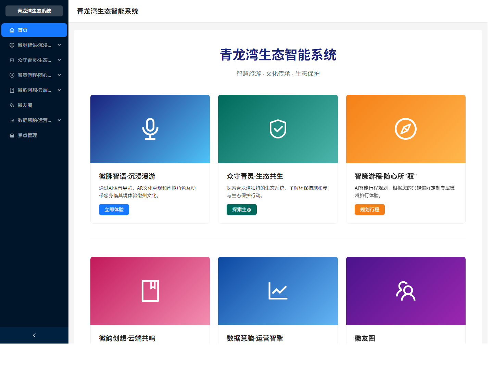
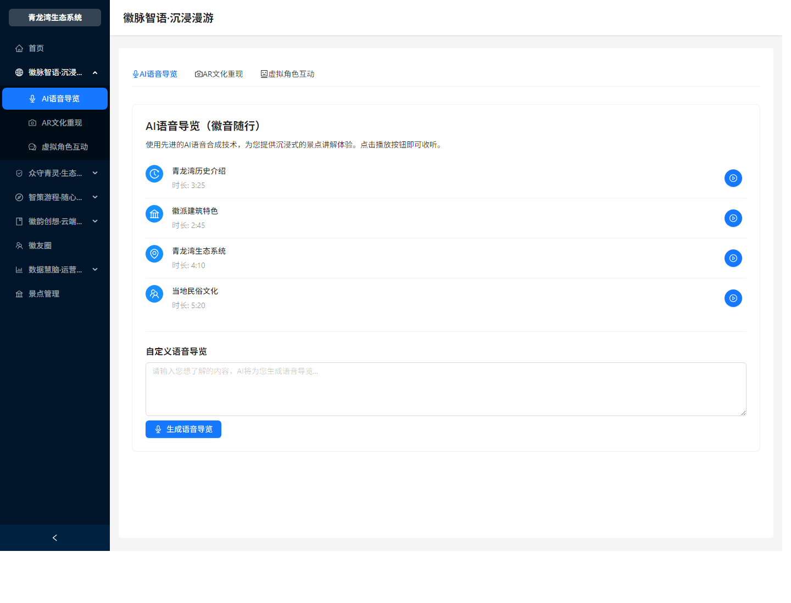
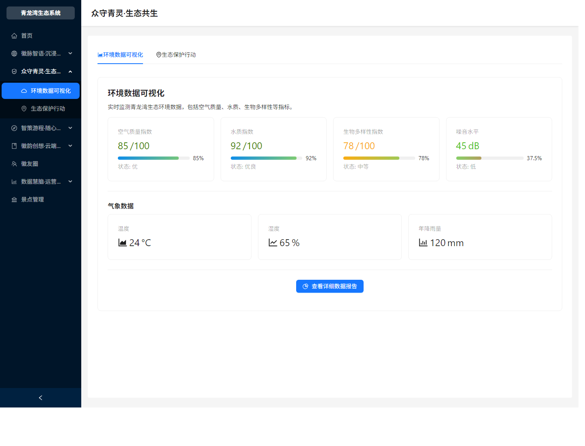
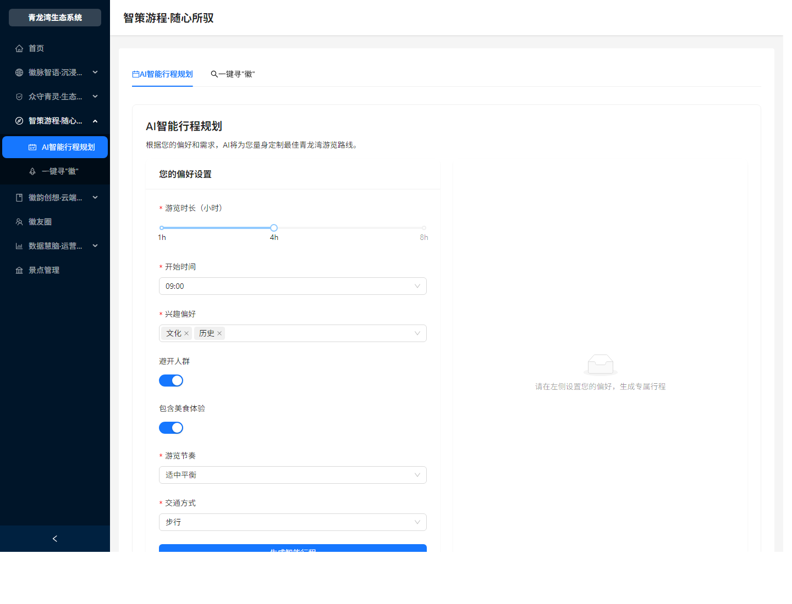
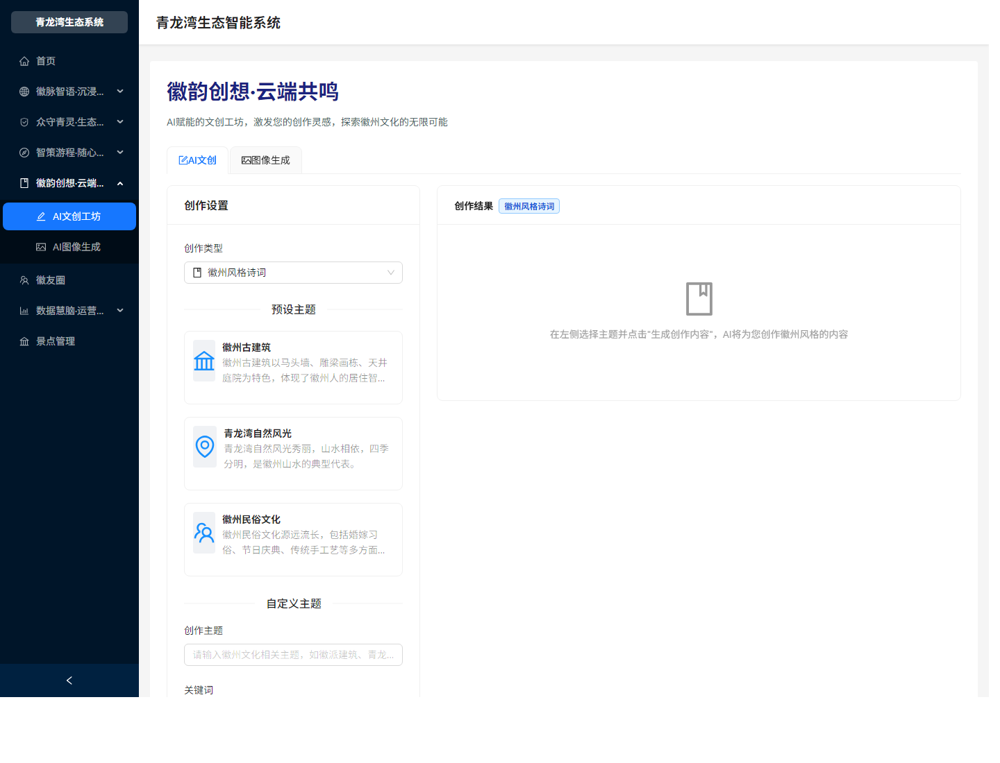

# 青龙湾生态智能系统


青龙湾生态智能系统是一个面向生态文旅场景的综合服务平台，围绕“智慧旅游、文化传承、生态保护、数据运营”构建沉浸式导览、智能游程、AI 文创、生态共生和运营洞察等能力。项目采用前后端分离架构，适合课程展示、创新创业比赛、文旅产品原型和二次开发。

<p align="center">
  
</p>

## 功能预览

<table>
  <tr>
    <td width="50%"></td>
    <td width="50%"></td>
  </tr>
  <tr>
    <td align="center">沉浸漫游</td>
    <td align="center">生态共生</td>
  </tr>
  <tr>
    <td width="50%"></td>
    <td width="50%"></td>
  </tr>
  <tr>
    <td align="center">智能游程</td>
    <td align="center">文创工坊</td>
  </tr>
</table>

## 核心模块

| 模块 | 已实现能力 |
| --- | --- |
| 徽脉智语·沉浸漫游 | AI 语音导览、AR 文化重现、小青徽虚拟导游互动 |
| 众守青灵·生态共生 | 环境数据可视化、生态保护活动、生态状态展示 |
| 智策游程·随心所驭 | 个性化行程表单、一键寻徽、路线规划结果区 |
| 徽韵创想·云端共鸣 | AI 文创工坊、图像生成入口、徽友圈内容社区 |
| 数据慧脑·运营智擎 | 游客行为洞察、运营决策优化、数据看板入口 |
| 景点资源管理 | 景点列表、新增、编辑、删除与经纬度维护 |

## 技术栈

| 层级 | 技术选型 |
| --- | --- |
| 前端 | React 18, Vite 6, TypeScript, Ant Design, Material UI, Three.js |
| 后端 | Node.js, Express, TypeScript, WebSocket, Axios |
| 数据 | SQLite, schema migration, seed data |
| AI 能力 | 百度千帆文本/图像接口，讯飞虚拟人 WebSocket 接入预留 |
| 工程化 | npm workspaces, concurrently, cross-env, Prettier |

## 快速开始

环境要求：

- Node.js 18 或更高版本
- npm 9 或更高版本
- 支持 WebGL 的现代浏览器

安装依赖：

```bash
npm install
```

初始化 SQLite 数据：

```bash
npm run migrate
npm run seed
```

启动开发环境：

```bash
npm run dev
```

默认服务地址：

| 服务 | 地址 |
| --- | --- |
| 前端应用 | `http://localhost:3000` |
| 后端 API | `http://localhost:5000/api` |
| 健康检查 | `http://localhost:5000/api/health` |
| 虚拟人 WebSocket | `ws://localhost:5000/ws` |

## 环境变量

复制 `.env.example` 为 `.env` 后按需配置。未配置真实密钥时，系统会以本地演示方式运行，适合公开展示和本地开发。

```bash
QIANFAN_API_KEY=
USE_MOCK_API=true

XFYUN_APP_ID=
XFYUN_API_KEY=
XFYUN_API_SECRET=
XFYUN_SCENE_ID=
XFYUN_AVATAR_ID=
XFYUN_VCN=x4_lingxiaoying_assist
```

## API 概览

| Method | Endpoint | 用途 |
| --- | --- | --- |
| `GET` | `/api/health` | 后端健康检查 |
| `GET` | `/api/attractions` | 获取景点列表 |
| `POST` | `/api/attractions` | 新增景点 |
| `PUT` | `/api/attractions/:id` | 更新景点 |
| `DELETE` | `/api/attractions/:id` | 删除景点 |
| `POST` | `/api/ai/chat` | AI 文本生成与对话 |
| `POST` | `/api/ai/image` | AI 图像生成 |
| `POST` | `/api/virtual-human/token` | 创建虚拟人会话 |

## 项目结构

```text
.
├── backend/                 # Express + TypeScript 后端服务
│   ├── scripts/             # 数据库迁移与种子脚本
│   └── src/
│       ├── routes/          # attractions / ai / virtual-human
│       └── services/        # AI 服务封装
├── database/                # SQLite schema 与 seed 数据
├── docs/
│   └── screenshots/         # README 展示截图
├── frontend/                # React 前端应用
│   ├── public/              # 图片、模型、播放器静态资源
│   └── src/
│       ├── components/      # AR、虚拟人、布局和表单组件
│       ├── pages/           # 五大业务模块页面
│       └── services/        # 前端 API 封装
├── .env.example             # 环境变量示例
├── package.json             # npm workspaces 根配置
└── README.md
```

## 常用命令

| 命令 | 说明 |
| --- | --- |
| `npm run dev` | 同时启动前端和后端 |
| `npm run build` | 编译后端并构建前端生产包 |
| `npm run check` | 执行项目构建校验 |
| `npm run migrate` | 创建 SQLite 数据表 |
| `npm run seed` | 写入示例景点数据 |
| `npm run --workspace frontend preview` | 预览前端生产构建 |

## License

本项目用于教学、比赛和演示场景。商业使用前请确认第三方 API、素材、模型服务和图片资源授权。
